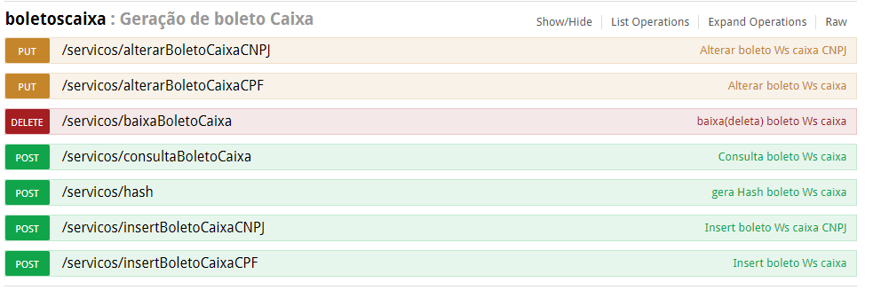

## caixa-boleto

O projeto caixa-boleto, e uma lib. que recebe o objeto de inclusão, alteração e consulta. Realizando a operação no serviço da caixa, e retorna o result.
Ele facilita a comunicação do projeto com a caixa por receber o objeto em json

Este projeto foi gerado a partir de um gerador automático de código.

Para fazer teste existe uma classe ***Main***, esta classe e responsável por ter o código de montagem do objeto. Foi utilizada durante o desenvolvimento,
para fazer os testes de construção e envio dos dados. atualmente e utilizada para manutenção caso suja algum problema ou precise debugar para algum erro.

Caso seja necessário mais alguma informação consultar a documentação da caixa. [Documentação usada para criação da LIB](readme-uploads/leituraArquivoCaixa.pdf)

Atualmente está lib. está sendo usada dentro do CR5 como apoio para o registro de boletos na caixa segue abaixo um print dos endpoints onde ela e utilizada.



## Instalação

1) Fazer a importação normal na sua IDE.
2) executar a instalação dos pacotes pelo maven

Maven: 
    
    mvn clean -U install -DskipTests=true

## Deploy

Todas as publicações de versão (SNAPSHOT e Release) devem ser realizadas direto pelo GIT seguindo o fluxo:
1. Gerar snapshot: Será gerado um novo snapshot e publicado no artifactory(ext-snapshot-local) sempre que for realizado um push no branch master. Observe que o padrão da versão é baseado no nome do branch + Hash de identificação do commit;
1. Gerar versão de produção: Será gerada nova versão e publicada no artifactory(ext-release-local) sempre que for gerada uma tag, sendo que este processo é manual e deve ser executado pela Web console do GIT. Observe que o nome da tag(tagname) deve refletir  a versão do projeto a ser publicada;
O pushs no branch de desenvolvimento não dispararão nenhum ação do CI, contudo lembre-se de sempre utilizar este branch, baseando-se no fluxo [GITFLOW Workflow](https://www.atlassian.com/br/git/tutorials/comparing-workflows/gitflow-workflow)

    
## Instalação em projetos

Segue o exemplo de como funciona e como fazer a instalação no projeto

Para usar o projeto basta instalar a dependência Maven:

```
<dependency>
    <groupId>br.gov.caixa.sibar</groupId>
    <artifactId>caixa-boleto</artifactId>
    <version>{VERSÃO DO PROJETO CAIXA BOLETO}</version>
</dependency>
```

## Exemplos

### Pessoa Física

#### Objeto

Objeto para incluir um boleto de pessoa física.

utilizar a classe ***DadosDto*** que vem da lib. do boleto-caixa para incluir, utiliza como referência a documentação da caixa para fazer o preenchimento.

#### Incluir

```
 // estanciar o objeto
    IncluirBoletoPessoaFisicaService incluirBoletoPessoaFisicaService = new IncluirBoletoPessoaFisicaService();
 
 // inclui o boleto na caixa e registra
    Servico_saida_negocial_Type servico_saida_negocial_type = incluirBoletoPessoaFisicaService.incluirBoletoPessoaFisica(dadosDto);
```

#### Alterar

```
// estanciar o objeto
AlteraBoletoPessoaFisicaService alteraBoletoPessoaFisicaService = new AlteraBoletoPessoaFisicaService();

// inclui o boleto na caixa e registra
Servico_saida_negocial_Type servico_saida_negocial_type = alteraBoletoPessoaFisicaService.alterarBoletoPessoaFisica(dadosDto);

```

#### Deletar
utilizar o objeto da lib. para deletar um boleto na caixa ***ServicoEntradaNegocialTypeDto***


```
// estanciar o objeto
BaixaBoletoService baixaBoletoService = new BaixaBoletoService();

// inclui o boleto na caixa e registra
Servico_saida_negocial_Type servico_saida_negocial_type = baixaBoletoService.baixaBoleto(servicoEntradaNegocialTypeDto);

```


### Pessoa Jurídica

#### Objeto 

Objeto para incluir um boleto de pessoa jurídica.

utilizar a classe ***DadosDto*** que vem da lib. do boleto-caixa para incluir, utiliza como referência a documentação da caixa para fazer o preenchimento.

#### Incluir 

```
 // estanciar o objeto
    IncluirBoletoPessoaJuridicaService incluirBoletoPessoaJuridicaService = new IncluirBoletoPessoaJuridicaService();
 
 // inclui o boleto na caixa e registra
    br.gov.caixa.sibar.manutencao_cobranca_bancaria.boleto.externo.pessoa_juridica.Servico_saida_negocial_Type servico_saida_negocial_type = incluirBoletoPessoaJuridicaService.incluirBoletoPessoaJuridica(dadosDto);
```


#### Alterar

```
// estanciar o objeto
AlterarBoletoPessoaJuridicaService alterarBoletoPessoaJuridicaService = new AlterarBoletoPessoaJuridicaService();

// inclui o boleto na caixa e registra
br.gov.caixa.sibar.manutencao_cobranca_bancaria.boleto.externo.pessoa_juridica.Servico_saida_negocial_Type servico_saida_negocial_type =
                alterarBoletoPessoaJuridicaService.alteraBoletoPessoaJuridica(dadosDto);

```

#### Deletar
utilizar o objeto da lib. para deletar um boleto na caixa ***ServicoEntradaNegocialTypeDto***


```
// estanciar o objeto
BaixaBoletoService baixaBoletoService = new BaixaBoletoService();

// inclui o boleto na caixa e registra
Servico_saida_negocial_Type servico_saida_negocial_type = baixaBoletoService.baixaBoleto(servicoEntradaNegocialTypeDto);

```


